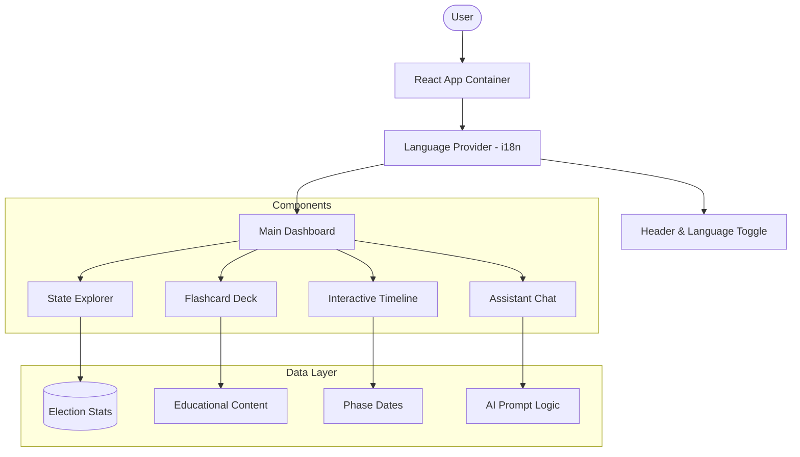

# 🇮🇳 Election Assistant

An interactive, multilingual web application designed to educate and empower Indian voters by simplifying the electoral process.

## 🔗 Live Demo

Check out the live application here: **[Live Demo Link](https://election-assistant-my-prompt-1-495215.a.run.app)** 

## 🌟 Features

The Election Assistant provides a centralized platform for citizens to understand election timelines, explore state-specific voting information, and interact with an AI-powered assistant.

### 🗳️ Core Modules
- **🤖 AI Assistant Chat**: An intelligent conversational interface to get instant answers about voting rights, eligibility, and procedures.
- **🗺️ Interactive State Explorer**: Deep-dive into state-specific data with search functionality and real-time filtering.
- **⏳ Visual Election Timeline**: A step-by-step interactive roadmap of the election phases, ensuring voters never miss a deadline.
- **🗂️ Educational Flashcards**: High-impact visual cards that explain complex electoral concepts in simple terms.
- **🌐 Multilingual (English/Hindi)**: Full localized support to ensure accessibility for a wider audience.

### 🎨 Design & Experience
- **Modern UI**: Built with a "premium glassmorphism" aesthetic for a clean, professional feel.
- **Micro-animations**: Smooth transitions and hover effects that enhance user engagement.
- **Mobile First**: Fully responsive design that works flawlessly on smartphones, tablets, and desktops.

## 🏗️ Architecture



## 🛠️ Tech Stack

- **Frontend**: React 18, Vite
- **Styling**: Vanilla CSS (Custom Design System)
- **Icons**: Lucide React
- **Containerization**: Docker
- **Web Server**: Nginx

## 🚀 Getting Started

### Prerequisites
- Node.js (v18+)
- npm or yarn

### Installation
1. Clone the repository:
   ```bash
   git clone https://github.com/ISR1313/election-assistant.git
   cd election-assistant
   ```
2. Install dependencies:
   ```bash
   npm install
   ```
3. Run in development mode:
   ```bash
   npm run dev
   ```

### Docker Deployment
The project is container-ready for easy deployment:
```bash
docker build -t election-assistant .
docker run -p 8080:80 election-assistant
```

## 📄 License
Distributed under the MIT License.
